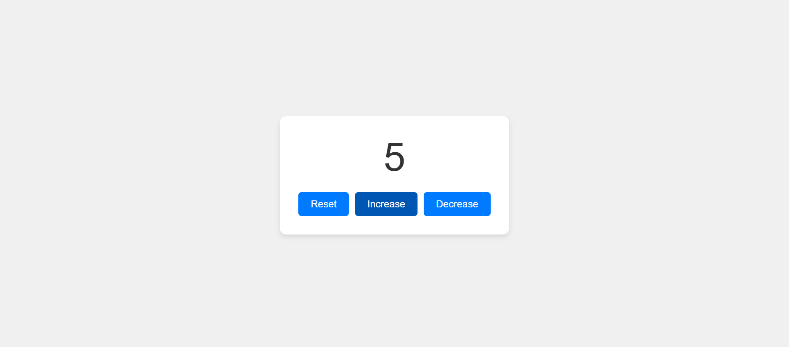
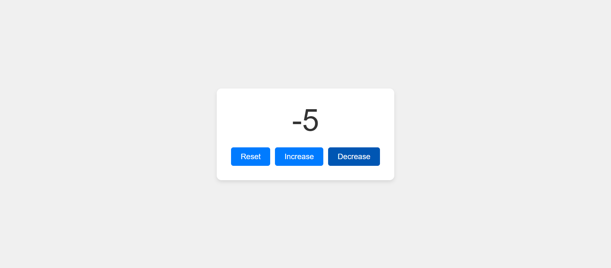
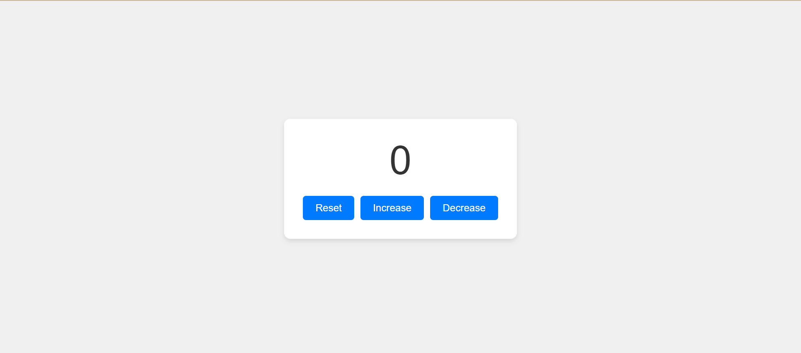

# Counter Project

This project is a basic web-based counter that allows users to increase, decrease, or reset a displayed numeric value. It also generates a random value from a set of predefined options when the page loads.

## Features
- **Increase the counter** by clicking the "Increase" button.
- **Decrease the counter** by clicking the "Decrease" button.
- **Reset the counter** to `0` using the "Reset" button.

## Screenshots

Here are some screenshots of the website:

### increase page

### decrease page

### reset page

## How to Run
1. Download or clone the repository to your local machine.
2. Open the `index.html` file in any web browser.
3. Interact with the counter using the buttons, and check the console for the randomly generated value.

## File Descriptions
- `index.html`: Contains the HTML structure of the project.
- `count.css`: Styles the counter and buttons for better visual presentation.
- `counter.js`: Handles the counter functionality and random value generation.
- `README.md`: Documentation and instructions for the project.

## Technologies Used
- HTML
- CSS
- JavaScript

## License
This project is available under the [MIT License](LICENSE).
